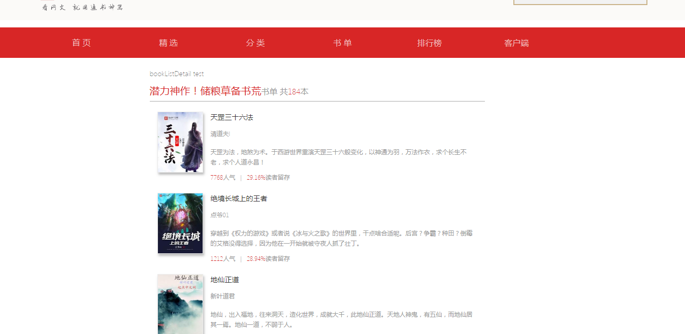
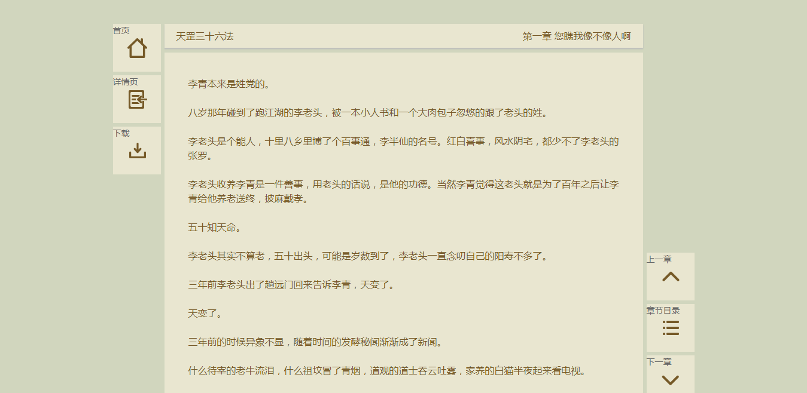

## 追书神器web练习    

纯属个人学习react,不用与商业用途    

### 技术栈     
> react + react-router-dom + redux + webpack 

### 项目运行
- git clone git clone https://github.com/amumu233/zhuishushenqi.git    
- cd zhuishushenqi    
- npm install      
- npm start      
- 访问: http://localhost:18080    

### 追书神器API接口文档

[追书神器API接口文档]('./API-接口文档.md')

### 目标功能
- 主页      
- 精选     
- 分类     
- 书单     
- 排行     
- 书籍详情     
- 书单详情     
- 阅读书籍    

### 功能实现
- 路由: react-router-redux    
- 状态管理:  redux + react-redux + redux-thunk(解决异步的action)       
- 代码分割(按需加载):  bundle-loader + Bundle组件    

### screenshots

主页

精选

分类

书单

书单详情

排行

书籍详情

阅读书籍

